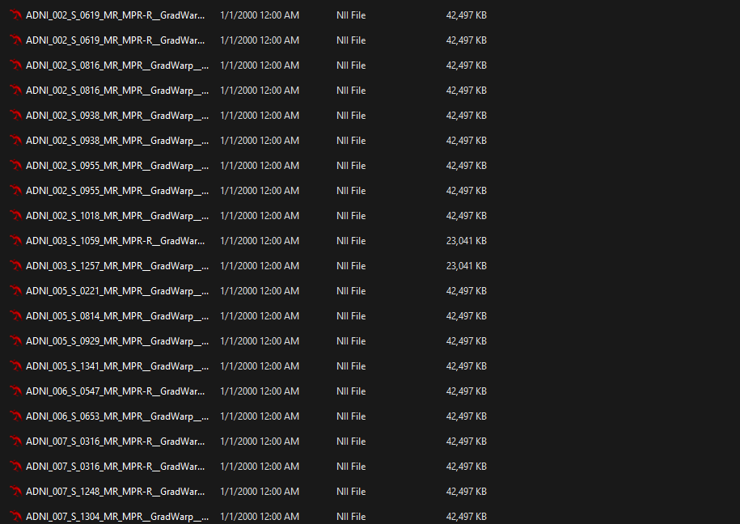
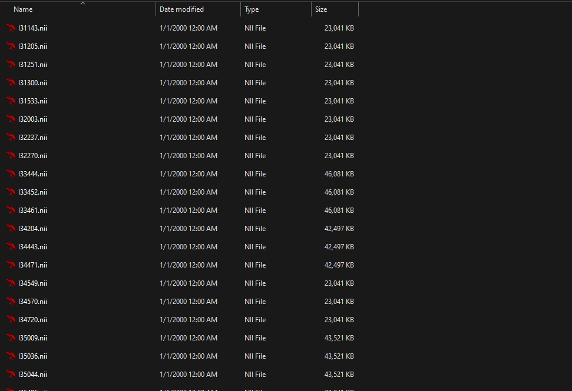
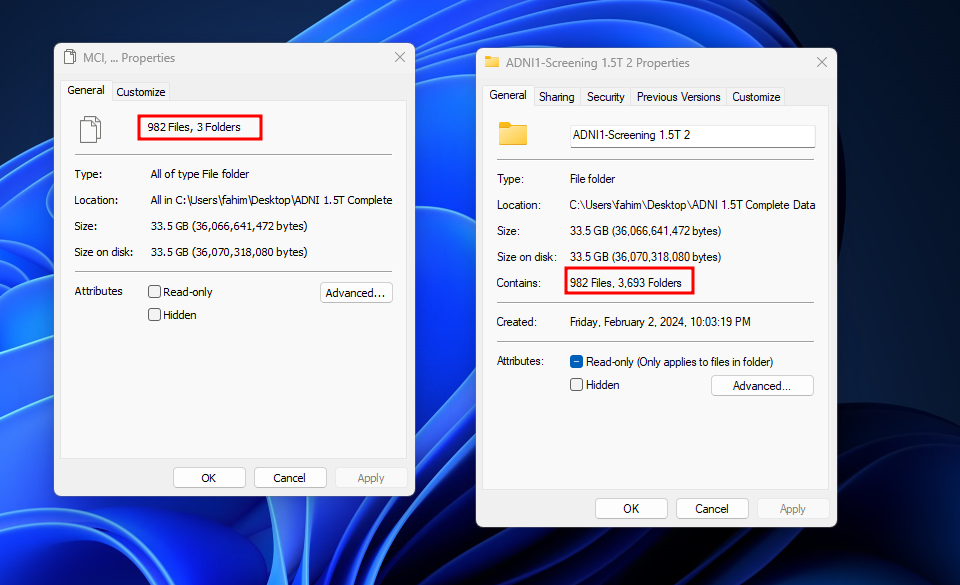

Alzheimer's Disease Neuroimaging Initiative (ADNI) dataset organization based on the group name (AD, MCI, CN)
Organize the entire ADNI dataset based on the group name (AD, MCI, CN) locally. Then, remove all the subdirectories of the individual subjects and keep only the data of the subjects based on the group name. Lastly, rewrite the `.nii` files' filenames to the subject's ID. 

Therefore, I have created 3 separate scripts to perform these tasks. The first script will organize the entire ADNI dataset based on the group name (AD, MCI, CN) locally. The second script will remove all the subdirectories of the individual subjects and keep only the data of the subjects based on the group name. The third script will rewrite the `.nii` files' filenames to the subject's ID. The reason for creating three separate scripts is to make the process more modular and to make it easier to understand and maintain. One cruicial thing behind creating 3 separate scripts is that, it might be possible that the user may not want to perform all the tasks. Therefore, the user can choose to perform only the tasks that are required. However, the tasks should be performed sequentially. The order of the scripts and tasks are as follows:

1. `script.py` - Organize the entire ADNI dataset based on the group name (AD, MCI, CN) locally.
2. `remove_subdir_script.py` - Remove all the subdirectories of the individual subjects and keep only the data of the subjects based on the group name.
3. `rename_file_script.py` - Rewrite the `.nii` files' filenames to the subject's ID.


⭐ the repository if you found it helpful. 😊

## Table of Contents
- [Table of Contents](#table-of-contents)
- [Introduction](#introduction)
- [Screenshot](#screenshot)
- [Prerequisites](#prerequisites)
- [How to use](#how-to-use)
- [Experiment](#experiment)
- [License](#license)


🎁 The entire project is live at [fahimfba.github.io/organize-ADNI](https://fahimfba.github.io/organize-ADNI/)

## Introduction
The Alzheimer's Disease Neuroimaging Initiative (ADNI) dataset is a large dataset that contains the data of subjects with Alzheimer's disease (AD), Mild Cognitive Impairment (MCI), and Cognitively Normal (CN). The dataset is organized into different directories based on the subject's ID. This script will organize the entire ADNI dataset based on the group name (AD, MCI, CN) locally. 

The first script ([script.py](https://github.com/FahimFBA/organize-ADNI/blob/main/script.py)) will create 3 directories: `AD`, `MCI`, and `CN`. Each directory will contain the subjects' data based on the group name. The script will read the csv file that contains the list of the subjects and organize the dataset based on the group name. 

The second script ([remove_subdir_script.py](https://github.com/FahimFBA/organize-ADNI/blob/main/remove_subdir_script.py)) will remove all the subdirectories of the individual subjects and keep only the data of the subjects based on the group name. 

The third script ([rename_file_script.py](https://github.com/FahimFBA/organize-ADNI/blob/main/rename_file_script.py)) will rewrite the `.nii` files' filenames to the subject's ID. The script will rename the `.nii` files' filenames to the subject's ID. Suppose, a file name is `ADNI_002_S_0619_MR_MPR-R__GradWarp__N3__Scaled_2_Br_20081001115218896_S15145_I118678.nii`. It will be renamed to `I118678.nii`. 

This script can be used to organize the entire ADNI dataset based on the group name (AD, MCI, CN) locally. This script works successfully on Windows, Linux, and macOS.

## Screenshot

1. After running first script [`script.py`](https://github.com/FahimFBA/organize-ADNI/blob/main/script.py):


1. After running second script [`remove_subdir_script.py`](https://github.com/FahimFBA/organize-ADNI/blob/main/remove_subdir_script.py):


1. After running third script [`rename_file_script.py`](https://github.com/FahimFBA/organize-ADNI/blob/main/rename_file_script.py):


Lastly, I have analyzed the dataset and found that the dataset is organized successfully. 

Here, you can check the After & Before files and folders count side by side (Left Side = After, Right Side = Before).



## Prerequisites
- Python 3.9 or later

## How to use
1. Clone the repository to your local machine.
```bash
git clone https://github.com/FahimFBA/organize-ADNI.git
```
2. Copy the `script.py`, `remove_subdir_script.py`, and `rename_file_script.py` to the root directory of the ADNI dataset.
3. Copy the csv file that contains the list of the subjects to the root directory of the ADNI dataset.
4. Change the csv file name in the `script.py` to the name of the csv file that contains the list of the subjects.
5. Create 3 empty directories in the root directory of the ADNI dataset and name them `AD`, `MCI`, and `CN`.
6. Run the `script.py` using the following command, **if you want to organize the entire ADNI dataset based on the group name (AD, MCI, CN) locally**:
```bash
python script.py
```
or,
```bash
python3 script.py
```
7. The script will organize the entire ADNI dataset based on the group name (AD, MCI, CN) locally.
8. Run the `remove_subdir_script.py` using the following command, **if you want to remove all the subdirectories of the individual subjects and keep only the data of the subjects based on the group name**:
```bash
python remove_subdir_script.py
```
or,
```bash
python3 remove_subdir_script.py
```
9. The script will remove all the subdirectories of the individual subjects and keep only the data of the subjects based on the group name.
10. Run the `rename_file_script.py` using the following command, **if you want to rewrite the `.nii` files' filenames to the subject's ID**:
```bash
python rename_file_script.py
```
or,
```bash
python3 rename_file_script.py
```
11. The script will rewrite the `.nii` files' filenames to the subject's ID. Suppose, a file name is `ADNI_002_S_0619_MR_MPR-R__GradWarp__N3__Scaled_2_Br_20081001115218896_S15145_I118678.nii`. It will be renamed to `I118678.nii`.


*Note: Here the root directory implies that directory which contains all the subject folders.*

## Experiment
The script was tested on the ADNI dataset - ADNI1: Screening 1.5T having 1075 subjects. The dataset contains 3 groups of subjects: AD, MCI, and CN. The script was able to organize the dataset based on the group name. The dataset was organized into 3 directories: `AD`, `MCI`, and `CN`. Each directory contains the subjects' data based on the group name. The dataset was organized successfully. This script can be used to organize the entire ADNI dataset based on the group name (AD, MCI, CN) locally. This script works successfully on Windows, Linux, and macOS.

## License
This project is licensed under the Apache License - see the [LICENSE](https://github.com/FahimFBA/organize-ADNI/blob/main/LICENSE) file for details.