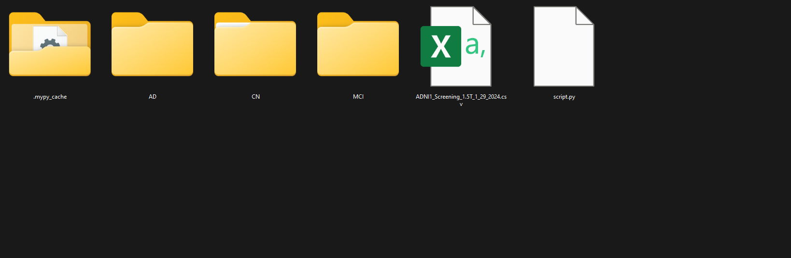

# Alzheimer's Disease Neuroimaging Initiative (ADNI) dataset organization based on the group name (AD, MCI, CN)
Organize the entire ADNI dataset based on the group name (AD, MCI, CN) locally.

## Introduction
The Alzheimer's Disease Neuroimaging Initiative (ADNI) dataset is a large dataset that contains the data of subjects with Alzheimer's disease (AD), Mild Cognitive Impairment (MCI), and Cognitively Normal (CN). The dataset is organized into different directories based on the subject's ID. This script will organize the entire ADNI dataset based on the group name (AD, MCI, CN) locally. The script will create 3 directories: `AD`, `MCI`, and `CN`. Each directory will contain the subjects' data based on the group name. The script will read the csv file that contains the list of the subjects and organize the dataset based on the group name.

## Screenshot



## Prerequisites
- Python 3.9 or later

## How to use
1. Clone the repository to your local machine.
2. Copy the `script.py` to the root directory of the ADNI dataset.
3. Change the csv file name in the `script.py` to the name of the csv file that contains the list of the subjects.
4. Create 3 empty directories in the root directory of the ADNI dataset and name them `AD`, `MCI`, and `CN`.
5. Run the `script.py` using the following command:
```bash
python script.py
```
or,
```bash
python3 script.py
```
6. The script will organize the dataset based on the group name (AD, MCI, CN).


## Experiment
The script was tested on the ADNI dataset - ADNI1: Screening 1.5T having 1075 subjects. The dataset contains 3 groups of subjects: AD, MCI, and CN. The script was able to organize the dataset based on the group name. The dataset was organized into 3 directories: `AD`, `MCI`, and `CN`. Each directory contains the subjects' data based on the group name. The dataset was organized successfully. This script can be used to organize the entire ADNI dataset based on the group name (AD, MCI, CN) locally. This script works successfully on Windows, Linux, and macOS.

## License
This project is licensed under the Apache License - see the [LICENSE](LICENSE) file for details.